README.md

### Individual Submissio ### 

# Flashcard Learning App — FullStack SPA with Authentication, Admin Dashboard & Study History

## Video Demonstration 
### Watch the demonstration here:###

<p align="center">
  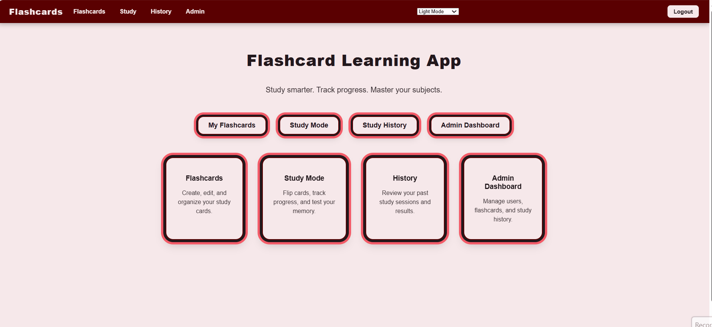
</p>

The Flashcard Learning App is a thorough learning app designed to give students a fast, clean, and personalised way to learn with digital cards. It works as a proper Single Page Application (SPA), making sure all actions happen without reloading the page, including logging in, managing flashcards, switching learning modes, and tracking history. The system combines a React frontend with a Node.js and Express backend, supported by a MongoDB database, and includes JWT security, access control, and a full admin dashboard. The app provides responsive interactions, lots of themes, 3D flip animation, and a structured learning process that keeps track of user progress.

The platform is built around three main elements: Users, Flashcards, and Study History. Users can sign up, log in, and access personal flashcard learning experience, while administrators have higher access to all users, flashcards, and training records. The flashcards support the full range of CRUD activities and include direct search for a live search functonality. Learning History is created automatically during Study Mode, letting users track their learning progress and allowing administrators to review activities in the system. These three entities fully meet the assignment requirement for the various expert panels that use CRUD.

The programme has a wide ramge of feautes to make learning more fun. You can create, edit, and delete flashcards with a question, answer, and options. The interface lets you flip cards in 3D for normal viewing and Study Mode. In Study Mode, flashcards show up randomly, and cards you’ve already seen get taken out of the active deck so you don’t have to see them again in the same session. All study progress is automatically stored in the database as part of the user's Learning History. The interface also has a theme system with light, dark and high contrast options, making it easy to use in different settings. The admin dashboard lets you see users, flashcards, and learning history, so you can keep track of the platform.

The project is built using a full set of modern JavaScript. The frontend uses React and the Context API to manage authentication, secure paths to control access, and Axios to talk to the API. The backend uses Express to handle RESTful routes, bcrypt to hash passwords, JWT for authentication, and Mongoose to work with MongoDB schemas. This setup makes for a modular, scalable, and easy-to-manage system where the frontend and backend work together smoothly, and the backend reliably handles data storage.

# Folder Structure

```text
FLASHCARD-APP/
│
├── backend/
│   │
│   ├── controllers/
│   │   ├── adminController.js
│   │   ├── authController.js
│   │   ├── flashcardController.js
│   │   └── historyController.js
│   │
│   ├── database/
│   │   └── flashcards_export.json
│   │
│   ├── middleware/
│   │   ├── authMiddleware.js
│   │   └── roleMiddleware.js
│   │
│   ├── models/
│   │   ├── Flashcard.js
│   │   ├── StudyHistory.js
│   │   └── User.js
│   │
│   ├── routes/
│   │   ├── adminRoutes.js
│   │   ├── authRoutes.js
│   │   ├── flashcardRoutes.js
│   │   └── historyRoutes.js
│   │
│   ├── scripts/
│   │   └── cleanupHistory.js
│   │
│   ├── .env.example
│   ├── makeAdmin.js
│   ├── package-lock.json
│   ├── package.json
│   └── server.js
│
├── frontend/
│   │
│   ├── public/
│   │   ├── favicon.ico
│   │   ├── favicon.png
│   │   ├── index.html
│   │   ├── logo192.png
│   │   ├── logo512.png
│   │   ├── manifest.json
│   │   ├── pen.png
│   │   └── robots.txt
│   │
│   ├── src/
│   │   │
│   │   ├── assets/
│   │   │   ├── screenshots/
│   │   │   └── pen.png
│   │   │
│   │   ├── components/
│   │   │   ├── AddForm.js
│   │   │   ├── AdminRoute.jsx
│   │   │   ├── Flashcard.js
│   │   │   ├── Navbar.jsx
│   │   │   └── ProtectedRoute.jsx
│   │   │
│   │   ├── context/
│   │   │   ├── AuthContext.js
│   │   │   └── ThemeContext.jsx
│   │   │
│   │   ├── pages/
│   │   │   ├── AdminDashboard.jsx
│   │   │   ├── Flashcards.jsx
│   │   │   ├── Home.jsx
│   │   │   ├── Login.jsx
│   │   │   ├── Register.jsx
│   │   │   ├── StudyHistory.jsx
│   │   │   └── StudyMode.jsx
│   │   │
│   │   ├── services/
│   │   │   ├── adminService.js
│   │   │   ├── authService.js
│   │   │   ├── flashcardService.js
│   │   │   └── historyService.js
│   │   │
│   │   ├── admin.css
│   │   ├── App.css
│   │   ├── App.js
│   │   ├── auth.css
│   │   ├── flashcards.css
│   │   ├── history.css
│   │   ├── home.css
│   │   ├── index.css
│   │   ├── index.js
│   │   ├── logo.svg
│   │   ├── navbar.css
│   │   ├── study.css
│   │   └── theme.css
│   │
│   ├── .gitignore
│   ├── package-lock.json
│   └── package.json
│
├── .gitignore
├── package-lock.json
└── README.md
```


# Screenshots

The system has a bunch of views like the Home Page, Admin Dashboard, Flashcard Creation and Editing screens, Study Mode (front and back), Theme Previews, MongoDB Compass view, and backend server console. These screenshots show the story format, content layout, learning process, and admin tools. All screenshots are saved at: frontend/src/assets/screenshots/

## Screenshots

### Home Page
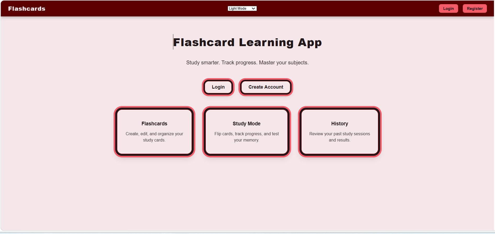

### Login Page
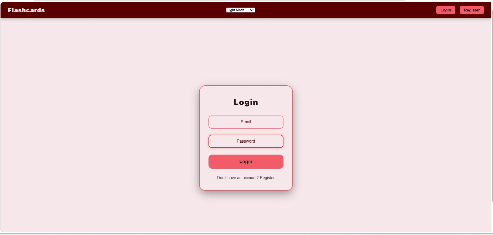

### Register Page
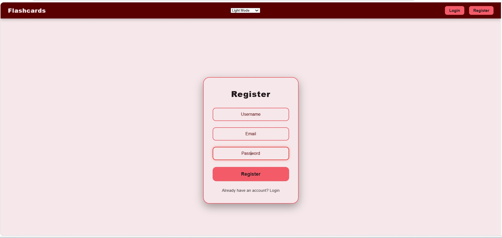

### Flashcard CRUD Page
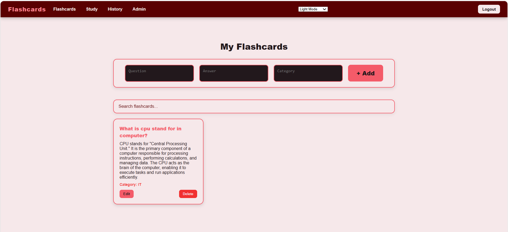

### Study Mode
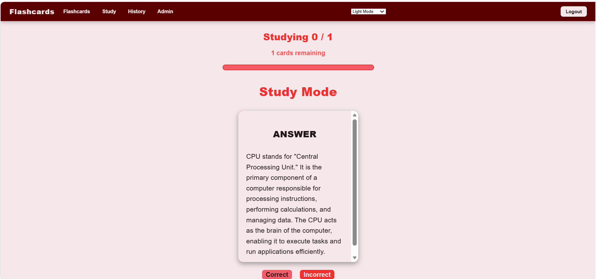

### Study History
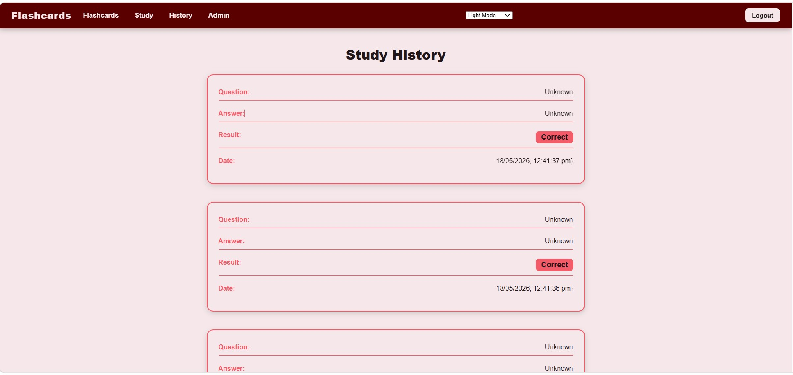

### User Page
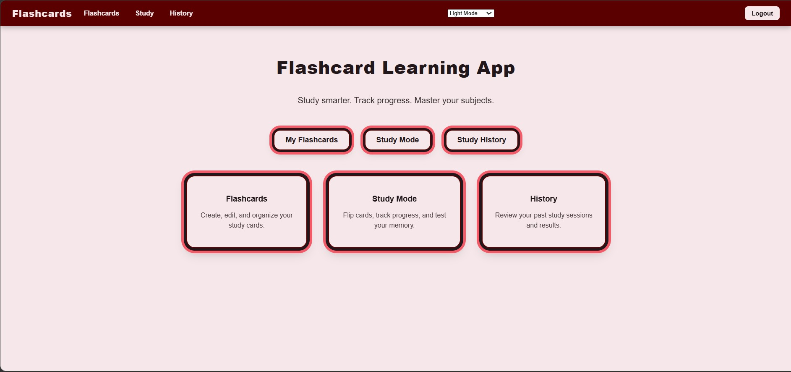

### Admin Dashboard
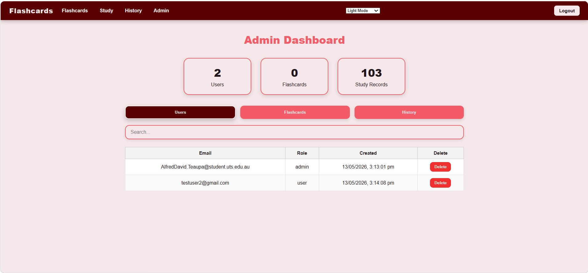

### Admin History
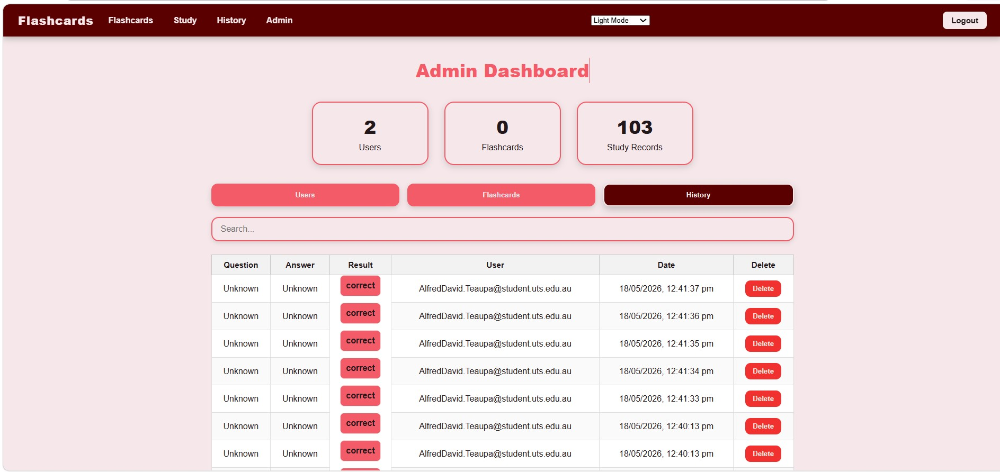

### Light Mode
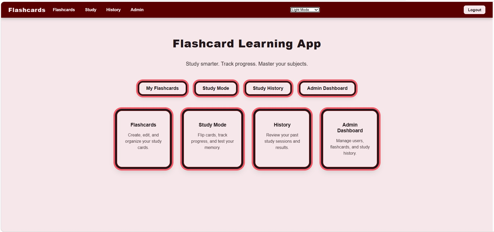

### Dark Mode
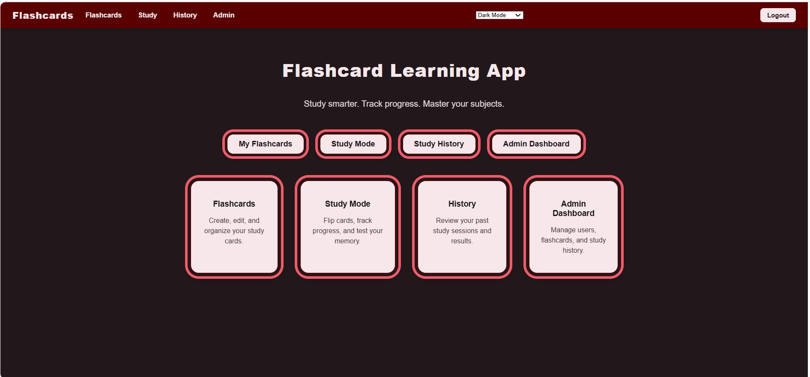

### High Contrast
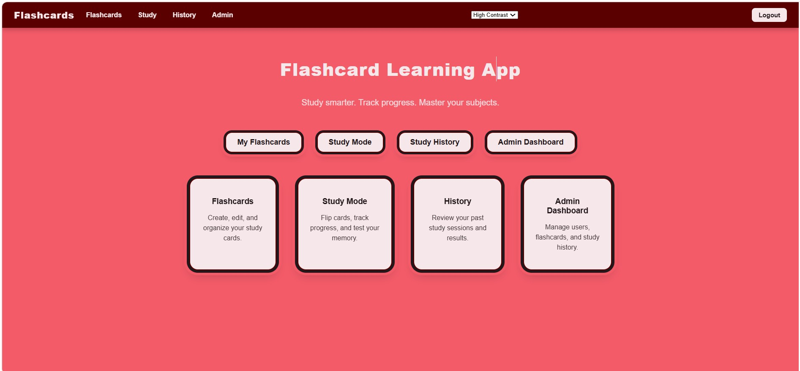

# Authentication

The system has two types of accounts: a regular user account for accessing the user and events dashboard, and an admin account that opens the Admin Dashboard with higher permissions. The authentication system uses JWT and bcrypt to keep user access secure. Users sign up with an email and password, which is hashed before being saved. When logging in, a JWT token is issued and used to access protected routes. The frontend uses the Context API to keep track of authentication status and uses the ProtectedRoute and AdminRoute components to control access to sensitive pages. Admins get increased access to all users, flashcards, and school history.

**Tutor Testing Note:** Instructors can set up a new account and make it an admin using the provided makeAdmin.js script or by automatically changing the user's role in MongoDB Compass. This lets you fully test the user and admin dashboards without needing pre-set login details.

# Overcoming Challenges

Make sure the app is stable and responsive. Careful schema design and checking were needed to fully manage the CRUD and Mongoose projects. The async communication between React and Express caused timing and state issues, which were sorted out with structured API functions and CORS updates. CORS problems were fixed by setting up the backend to respond to requests from the frontend dev server. It was important to use React standards, SPA-level rendering, and route protection. Other challenges included creating smooth animations, fixing UI bugs during editing and deletion, and centralising the API definition for easier maintenance.

# Deployment Overview

The system currently runs locally using the React development server on port 3000 and the Express backend on port 5000, with MongoDB running locally on MongoDB Atlas. For future deployments, it's suggested to use Vercel or Netlify for the frontend, Render or Railway for the backend, and MongoDB Atlas for the cloud. This setup supports a fully scalable and ready-to-build environment.

# Database Export

A sample of the dataset is included in the backend directory in database/flashcards_export.json. This export gives a set of flashcards to try out and show off.

## How to Run the App

### Backend

```bash
cd backend
npm install
Create a .env file inside the backend folder and add:
MONGO_URI=mongodb://127.0.0.1:27017/flashcards2
JWT_SECRET=your_jwt_secret_here
npm start
```

### Frontend

```bash
cd frontend
npm install
npm start
```

### Environment Variables

Create a `.env` file inside the `backend` folder:

```env
MONGO_URI=your_mongodb_connection_string
JWT_SECRET=your_secret_key
```

**MongoDB Note:** Instructors can run the backend using their MongoDB connection by creating a .env file in the backend folder. The system doesn't need access to the developer's personal MongoDB account. Instructors can use a local MongoDB setup or their MongoDB Atlas cluster. This lets them create users for testing and give the admin an account to try out the Admin Dashboard.

# Future Enhancements

Future improvements could include using a spaced-repetition algorithm to boost learning success, adding shuffle and progress tracking, creating user-specific decks and categories, expanding Study Mode with timers and scores, moving the database to the cloud for better scalability, and adding search and testing features. Other planned updates include password and forgotten email recovery, multiplayer training sessions, and making it mobile-friendly to make learning even better and improve the platform's features.

# Workload Allocation - Solo Project 

This work was personally completed by Alfred David Teaupa. The same student carried out all backend development, frontend implementation, UI design, CRUD functionality, authentication system, admin dashboard, database integration, testing, and documentation.

# Developer

**Developed by** - Alfred David Teaupa             **Student ID** - 11502770,  
University of Technology Sydney,  
**For Assignment 2:** Advanced Website Based on Modern Frontend Libraries.

